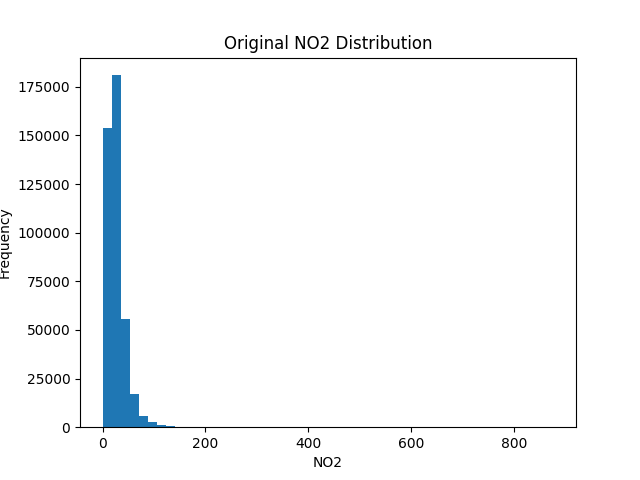
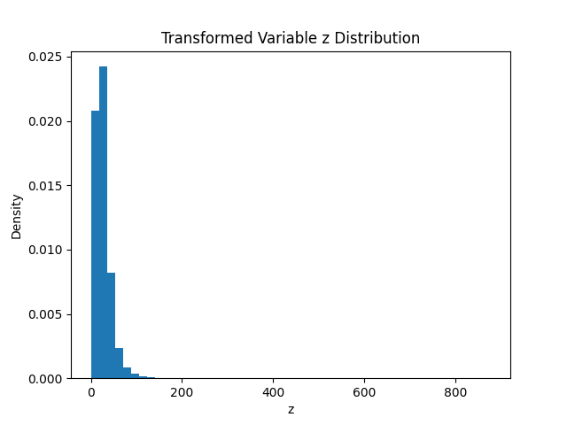
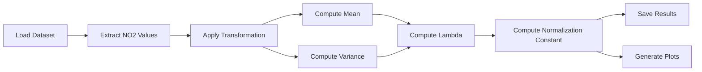
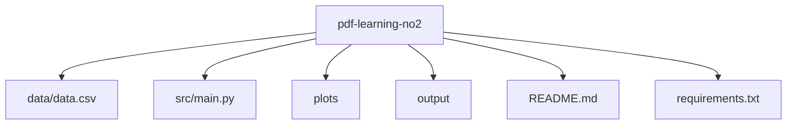

# 📊 Learning Probability Density Function (PDF) from NO₂ Air Quality Data

```{=html}
<p align="center">
```
``{=html}
``{=html}
``{=html}
``{=html}
```{=html}
</p>
```

------------------------------------------------------------------------

# 📌 Project Overview

This project implements **probability density function learning** using
real-world NO₂ air quality data from India.\
The objective is to transform the dataset and learn parameters of a
Gaussian-like probability distribution.

This project demonstrates:

-   Statistical modeling
-   Data transformation
-   Parameter estimation
-   Data visualization
-   Industry-standard project structuring

------------------------------------------------------------------------

# 🧠 Mathematical Formulation

## Data Transformation

The original variable x is transformed into z using:

z = x + a_r sin(b_r x)

Where:

-   r = 102303599
-   a_r = 0.05 × (r mod 7) = 0.30
-   b_r = 0.3 × ((r mod 5) + 1) = 1.5

------------------------------------------------------------------------

## Probability Density Function

The learned PDF follows:

p(z) = c e\^(−λ(z − μ)²)

Where:

-   μ = mean
-   λ = spread parameter
-   c = normalization constant

------------------------------------------------------------------------

# 📋 Learned Parameters

  Parameter   Description                        Value
  ----------- ---------------------------------- -----------------------
  μ           Mean of transformed distribution   25.819751672076492
  λ           Distribution spread parameter      0.0014619269889668285
  c           Normalization constant             0.021571875520386332

------------------------------------------------------------------------

# 📊 Results and Visualizations

## Original NO₂ Distribution



------------------------------------------------------------------------

## Transformed Variable Distribution



------------------------------------------------------------------------

# 📁 Output Files Generated

  File                       Description
  -------------------------- ----------------------------
  output/parameters.json     Parameters in JSON format
  output/parameters.txt      Human-readable parameters
  output/summary.csv         Parameter summary table
  plots/histogram_no2.png    Original data histogram
  plots/distribution_z.png   Transformed data histogram

------------------------------------------------------------------------

# 🏗️ Workflow Architecture



------------------------------------------------------------------------

# 📂 Project Structure



------------------------------------------------------------------------

# ⚙️ Installation

Clone repository:

git clone https://github.com/yourusername/pdf-learning-no2

Install dependencies:

pip install -r requirements.txt

------------------------------------------------------------------------

# ▶️ How to Run

cd src\
python main.py

------------------------------------------------------------------------

# 📈 Sample Output Table

  Parameter   Value
  ----------- -----------------------
  mu          25.819751672076492
  lambda      0.0014619269889668285
  c           0.021571875520386332

------------------------------------------------------------------------

# 🚀 Key Features

-   Industry‑standard project structure
-   Automated parameter estimation
-   Visualization pipeline
-   Exportable output files
-   Fully reproducible workflow

------------------------------------------------------------------------

# 👨‍💻 Author

Manleen Kaur\
Roll Number: 102303599

Thapar Institute of Engineering and Technology

------------------------------------------------------------------------

# 📜 License

This project is intended for academic and educational purposes.
